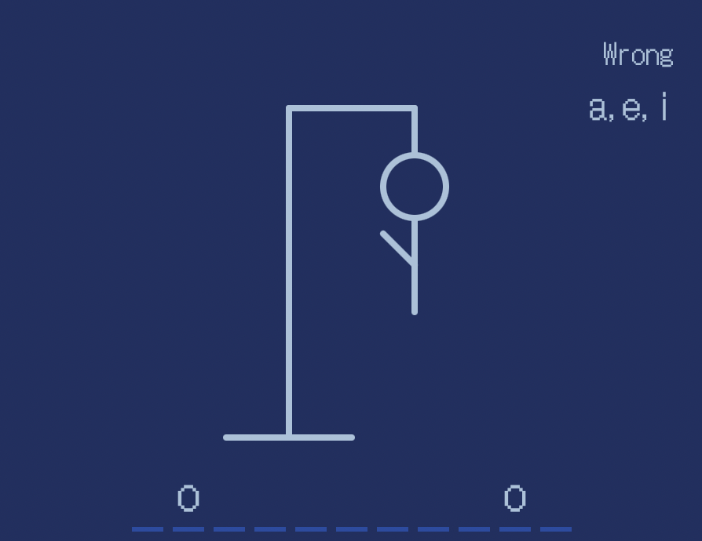

# Hangman-game-in-HTML

Implemented the classic hangman game in html, css and js.

Game logic: We will first randomly choose a word in the word list, then we will have the user try to enter a letter each time and check if it is in the word and do appropriate actions for if the letter is in the word or not. We will also check if the game ends each time the user finishes the entering letter action. Once we detect the game ends. The notficiation pops up and asks the user whether or not if they want to play again.

